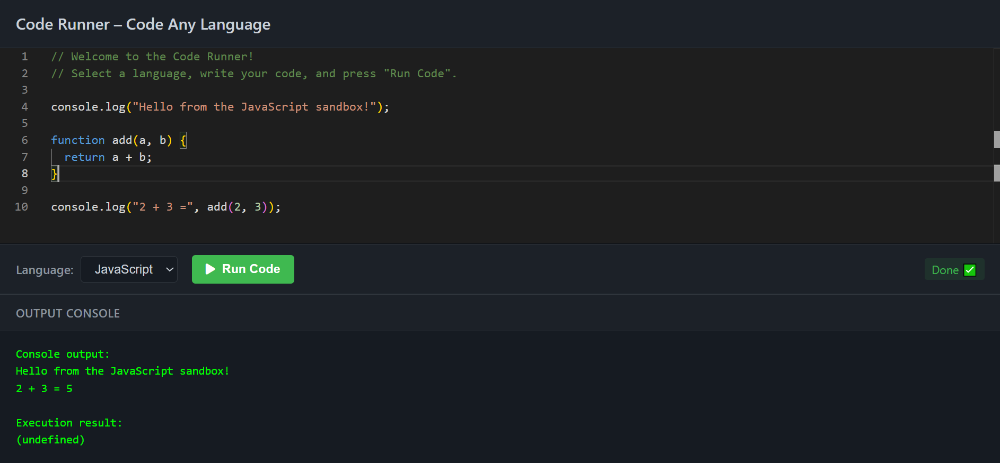

#  Code Runner – Code Any Language

A lightweight, browser-based code execution prototype that runs JavaScript, Python, and C++ inside isolated sandboxes using **Web Workers** and **Monaco Editor**.  
The system is designed to demonstrate how client-side code execution engines can be structured without any backend servers.

---

## 🚀 Overview

This project is a single-page application that allows users to:

- Write code in multiple languages
- Execute code safely inside sandboxed environments
- View live console output and results
- Switch languages instantly with preloaded templates

The core idea is to show how **scalable execution** can be achieved using the browser itself—each user tab acts as its own compute node.

---
## 📸 Preview

## ✨ Features

### • **JavaScript Execution (Fully Working)**
- Runs entirely inside a **Web Worker**
- Custom sandboxed environment
- Captures `console.log()` output
- Returns execution results and errors
- Non-blocking UI

### •**Python Execution (Fully working)**
- Designed to integrate with **Pyodide** (Python → WebAssembly)
- Worker pipeline, message flow, and console capture implemented
- Runtime loading can be enabled locally by placing Pyodide files in a folder

### • **C++ Execution (Architectural Stub)**
- Separate worker included
- Structured to support:
  - WebAssembly-based C++ execution
  - Compilers like Emscripten
- Fallback messages are shown if the runtime/toolchain is unavailable

### • **Java (Stub Only)**
- UI support included  
- Displays a clear message that JVM/WASM runtime is not part of this prototype

---

## 🧱 Architecture

### **1. Interface Layer**
- `index.html` – Web layout and structure  
- `styles.css` – Dark theme optimized for coding  
- `main.js` – Manages:
  - Editor setup  
  - Worker communication  
  - Language switching  
  - Output rendering  
  - Status badges (Running / Error / Success)

### **2. Execution Layer – Web Workers**
- `jsWorker.js` → JavaScript execution  
- `pyWorker.js` → Python execution pipeline  
- `cppWorker.js` → C++ execution placeholder  

Each worker:

- Runs in an isolated thread  
- Prevents blocking the UI  
- Returns structured messages to the main thread  

This creates a system that **scales effortlessly** because every browser tab provides its own compute power.

---

## 📂 Project Structure

project/
│── index.html
│── styles.css
│── main.js
│── jsWorker.js
│── pyWorker.js
│── cppWorker.js
│── .vscode/
│── README.md

---

## 🖥️ How to Run Locally

No installation, no build step.

1. Open the folder in VS Code  
2. Right-click `index.html` → **"Open with Live Server"**  
3. Your browser opens at `http://127.0.0.1:5500/`  
4. Write and run code directly in the browser  
5. JavaScript works fully; Python/C++ depend on local runtime files

---

## 📌 Future Enhancements

- Local Pyodide bundling for full Python support  
- WebAssembly-based C++ compilation  
- Add input fields & predefined test cases  
- Add resource limits (CPU / RAM / Time)  
- Multi-worker parallel execution  

---

## 📜 License

This project is provided for learning and demonstration purposes. You may modify and extend it freely.
